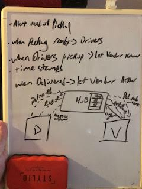
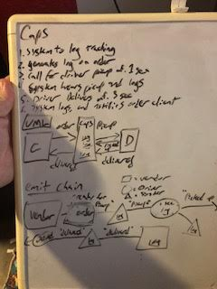
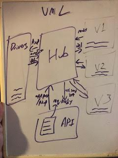
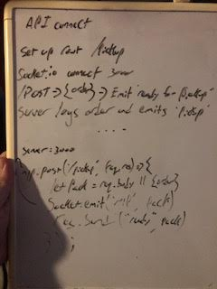

### LAB - Class 13

## Project: CAPS - Phase 2.5
## Auth: Julien Edwards

### Links and Resources

## 12

- [newAPIgithub](https://github.com/TrunkOfUkuleles/caps-api)
- [github](https://github.com/TrunkOfUkuleles/CAPS)

### Setup

#### How to initialize/run your application (where applicable)

caps-api
-/ 'npm run start'

CAPS
-/ 'node caps.js'
-/modules 'node vendor.js'
-/modules 'node vendor2.js'
-/modules 'node vendor3.js'
-/modules 'node driver.js'

#### Tests

ran the caps and vendor services along with the driover and noted the results. To be sure they were handling cases, I made two more vendors with different names and ran those through caps as well. 
#### UML / Application Wiring Diagram

11

12

13

